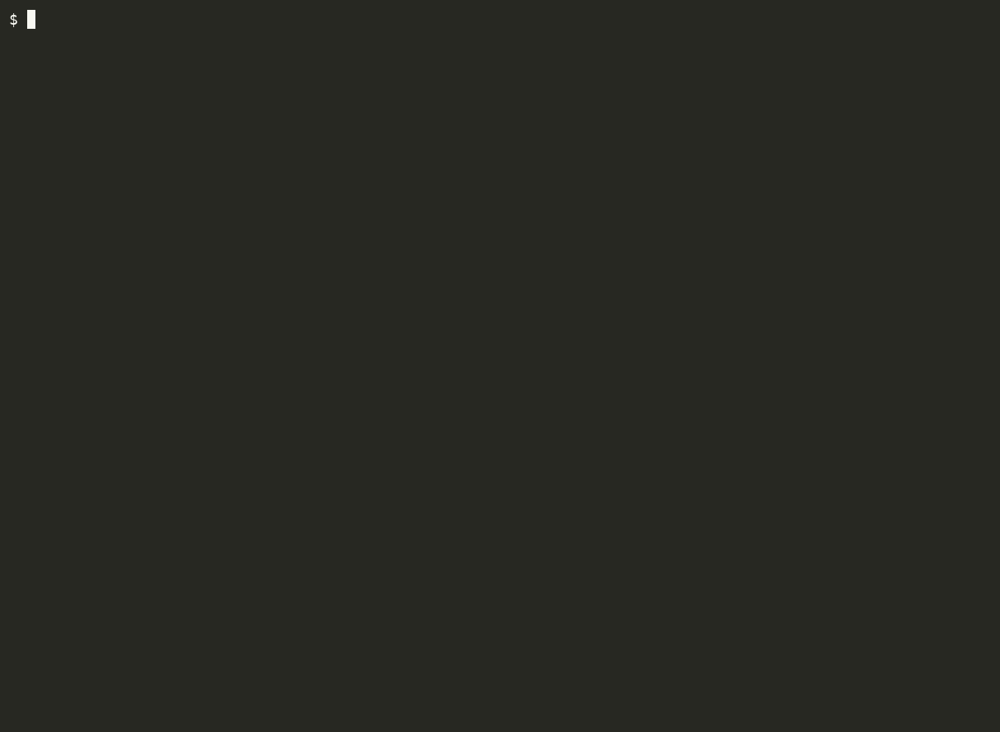

# lockrot

[](https://github.com/somework/lockrot/actions/workflows/ci.yml)
[](https://packagist.org/packages/somework/lockrot)
[](https://packagist.org/packages/somework/lockrot)
[](https://github.com/somework/lockrot/releases/latest)
[](LICENSE)

**Finds the packages in `composer.lock` that quietly stopped being maintained.**

Composer warns you about one kind of neglected dependency: the `abandoned` flag a maintainer sets by
hand. It says nothing about a package whose last release was in 2015, one pinned to a branch
snapshot, or one accepted on PHP 8.4 only because its constraint reads `>=5.3.0`.

lockrot reports all of them, with the evidence behind each call, the date the data was read, and the
dependency chain that pulled it in. It reads `composer.lock` and `composer.json`, and writes neither.

Requires PHP 7.4+ and Composer 2.2+.

## Contents

[Install](#install) · [First run](#first-run) · [What it reports](#what-it-reports) ·
[In CI](#in-ci) · [Not every finding is a problem](#not-every-finding-is-a-problem) ·
[Configuration](#configuration) · [Documentation](#documentation) · [Limitations](#limitations) ·
[Roadmap](#roadmap)

## Install

```bash
composer require --dev somework/lockrot
composer config allow-plugins.somework/lockrot true
```

Composer 2.2+ asks for plugin permission on the first `require`/`install`; the second command grants
it. This installs `composer lockrot`, alias `composer rot`.

Or run the PHAR, with no dependency added to your project:

```bash
curl -fsSL -o lockrot.phar https://lockrot.dev/lockrot.phar
php lockrot.phar -d /path/to/project --target-php=8.4
```

To verify a download, take both files from the release:

```bash
curl -fsSL -O https://github.com/somework/lockrot/releases/latest/download/lockrot.phar
curl -fsSL -O https://github.com/somework/lockrot/releases/latest/download/lockrot.phar.sha256
sha256sum -c lockrot.phar.sha256   # shasum -a 256 -c on macOS
```

Releases from 0.5.0 on are also GPG-signed (`lockrot.phar.asc`, key `39EC C3F6 4AE8 D06A 9A63
FD99 AB6F 7F52 AE51 3141`) and attested by GitHub (`gh attestation verify lockrot.phar --repo
somework/lockrot`); `phive install somework/lockrot` does the download and the signature check in
one step. From 0.6.0 on `php lockrot.phar self-update` verifies each release's `lockrot.phar.sig.json`
against the key built into the archive, with nothing installed on the machine.

[The PHAR, signatures, `self-update` and the global plugin install →](https://lockrot.dev/phar/)

## First run

```bash
composer lockrot --target-php=8.4
```

```text
critical (3)
  abandoned    sensio/framework-extra-bundle v6.2.10  direct
               marked abandoned by its repository, replacement: Symfony; repository archived on
               GitHub; last release 2023-02-24 (3.6 years ago); …; pulls in 1 flagged package:
               doctrine/annotations (abandoned)
  silent       javibravo/simpleue 2.1.0  direct
               last release 2017-11-15 (8.8 years ago); last push 2017-11-18 (8.8 years ago); …
  …
high (58)
  abandoned    doctrine/cache 2.2.0  via doctrine/doctrine-bundle, also via craue/config-bundle,
               doctrine/doctrine-migrations-bundle, doctrine/orm and 2 more
               marked abandoned by its repository; last release 2022-05-20 (4.3 years ago)
  abandoned    hoa/ruler 2.17.05.16  via wallabag/rulerz, also via wallabag/rulerz-bundle
               marked abandoned by its repository; last release 2017-05-16 (9.3 years ago); …
  …
200 packages checked · abandoned 19 · silent 8 · pinned 4 · left-behind 11 · old-promise 38 · stale 3 · …
priority: critical 3 · high 58 · medium 18 · low 4
libyears: 163.7 behind across 195 of 200 packages · 106.7 from direct requirements · furthest behind smalot/pdfparser v1.1.0 at 4.7
pulled in by: wallabag/rulerz-bundle 15 · wallabag/rulerz 14 · wallabag/phpepub 5 · …
…
```

Abridged — `…` marks where lines were cut. [The full run →](https://lockrot.dev/example-run/)



> **Set `GITHUB_TOKEN` for a complete run.** Without one, repository-activity checks are capped at 50
> packages, and lockrot reports how many were affected. Development dependencies are not checked
> unless you pass `--dev`.

Why is a row there — or why is a package you expected not? `composer lockrot --explain=vendor/package`
prints that one package with everything it was decided on: every signal's raw data and dates, the
release branches the repository lists with their dates, the repository activity, the thresholds.
[Explaining one package →](https://lockrot.dev/configuration/#explaining-one-package)

## What it reports

| Verdict | Meaning |
|---|---|
| `abandoned` | The package's Composer repository marks it abandoned (Packagist by default), or its repository is archived on GitHub or GitLab |
| `silent` | No stable release for at least 5 years **and** no repository push for at least 5 years; an archived repository is reported as `abandoned` instead |
| `pinned` | Installed version is a branch snapshot (`dev-*` or `#hash`), or the package has no stable release at all |
| `left-behind` | No stable release on the installed version's release branch for at least 3 years while a higher branch has released since, and within the last 3 — the package is alive, the branch you are on is not |
| `old-promise` | The installed version was released before the target PHP's GA date, and its `require.php` constraint is open-ended (`>=N`, `*`) for that target |
| `stale` | Old release or old push, but not old enough (or not on both fronts) for `silent` |
| `unknown` | No data could be obtained |
| `finished` | Matched the built-in or project allowlist — the package is complete by design, not neglected |
| `ok` | None of the above |

Each finding also carries a priority — `critical`, `high`, `medium`, `low`, or `none` for a package
the report does not flag. The verdict sets a base level, which drops one step for a transitive
package and one more for a development-only one, never below `low`. A security advisory on a
package nobody will fix — `abandoned`, `silent`, `left-behind` — is the vulnerability `composer audit` reports; here it raises the priority one step and marks the
evidence `no fix expected`, unless a release the repository already lists is out of the advisory's range, which the evidence then names (`fixed by 6.3.0`). The priority orders the report and is carried in every format. **`--fail-on` takes either a verdict or a priority**: `--fail-on=silent`
fails on what was observed, wherever the package sits; `--fail-on=high` fails on how much it applies
to this project. The baseline stays on the verdict.

A transitive finding names every direct requirement it is reachable from (`via a › b, also via c`),
not only the one its shortest chain starts from, and each direct requirement's evidence says what
flagged packages it pulls in. The `pulled in by:` summary line sums that up — [transitive
exposure](https://lockrot.dev/verdicts/#transitive-exposure).

The footer's `libyears:` line is one number for the whole lock: for each package, the years between
the release installed and the package's newest stable release, summed — 163.7 for wallabag, with the
package furthest behind named. It is laid over the verdicts, not one of them: every drift counts,
healthy patches included, so it says how far behind the lock is and nothing about why. Each finding
carries its own value in `--format=json`, and the report's block is the arithmetic over them —
[libyears](https://lockrot.dev/verdicts/#libyears).

[Every verdict, signal and priority rule →](https://lockrot.dev/verdicts/)

## In CI

| Code | Meaning |
|---|---|
| `0` | No finding reached the `fail-on` threshold (or `fail-on=none`) |
| `1` | A finding reached or exceeded the `fail-on` threshold |
| `2` | Tool or configuration error |

A network failure is reported as a note and never fails the run on its own, unless you pass
`--strict-network`. `--format=github` turns findings into pull-request annotations, `--format=sarif`
uploads them to the Security tab, `--format=gitlab` into a Code Quality report and
`--format=markdown` into a PR comment, and `--format=html` into a single-file page you can upload as a CI artifact and open.

On GitHub Actions, [somework/lockrot-action](https://github.com/somework/lockrot-action) runs the
verified release with annotations, a job summary and a metadata cache in one step:

```yaml
- uses: somework/lockrot-action@v1
  with:
    target-php: '8.4'
    fail-on: silent
```

Everywhere else, the PHAR or the Docker image `ghcr.io/somework/lockrot` does the same job.

[Exit codes and every output format →](https://lockrot.dev/ci/)

## Not every finding is a problem

A large project rarely starts clean. The **baseline** records the findings you have already seen and
decided to live with, so CI fails only on what is new or has got worse, without turning `--fail-on`
off and losing the check entirely. Commit the file: it is a statement about the project, worth
reviewing like any other change, and the only file lockrot ever writes — on this flag alone.

```bash
composer rot --target-php=8.4 --generate-baseline
```

An **allowlist** covers packages that are finished by design rather than neglected. lockrot ships a
built-in one — `psr/*`, `fig/*`, `symfony/polyfill-*` and more — and those report as `finished`. To
silence a dependency of your own, add it to `extra.lockrot.ignore`; `package` and `reason` are
mandatory, `version` and `expires` optional:

```json
{ "extra": { "lockrot": { "ignore": [
    { "package": "acme/legacy-bridge", "reason": "internal fork, tracked in ACME-123", "expires": "2027-01-01" }
] } } }
```

[Baseline →](https://lockrot.dev/baseline/) · [Allowlist and `ignore` →](https://lockrot.dev/configuration/)

## Configuration

Settings live under `extra.lockrot` in `composer.json`. CLI options win over environment variables,
which win over `composer.json`.

| `extra.lockrot` key | CLI option | Default | Meaning |
|---|---|---|---|
| `fail-on` | `--fail-on=<verdict or priority>` | `none` | Exit 1 threshold: a verdict (`stale`, `old-promise`, `left-behind`, `pinned`, `silent`, `abandoned`) or a priority (`low`, `medium`, `high`, `critical`) |
| `target-php` | `--target-php=8.4` | `config.platform.php`, else the running PHP | PHP version the project runs on: decides `old-promise`, and which branch `left-behind` suggests |
| `format` | `--format=<name>` | `table` | `table`, `json`, `github`, `sarif`, `gitlab`, `markdown` or `html` |
| `include-dev` | `--dev` | `false` | Also check `packages-dev`, one priority step lower |
| `install-time` | — | `on` | Print a compact block during `composer require`/`update`/`install` |
| `ignore` | — | `[]` | Project allowlist |
| — | `--all` | | Show every checked package, not only flagged ones |
| — | `--generate-baseline` | | Write this run's findings to the baseline file and exit 0 |
| — | `--explain=vendor/package` | | One package: its verdict, every signal with its raw data, and the repository facts behind them; exit 0 |

`extra.lockrot` is validated against
[`resources/lockrot-config.schema.json`](resources/lockrot-config.schema.json). Package metadata comes
from the repositories configured in your `composer.json`, through Composer's own repository layer —
Private Packagist, Satis and mirrors included, with its authentication, proxy settings and metadata
cache. Repository activity comes from GitHub, GitLab and Bitbucket Cloud and is cached for 24 hours.

[Full configuration reference →](https://lockrot.dev/configuration/) ·
[How lockrot fetches metadata →](https://lockrot.dev/internals/)

## Documentation

Everything is at [lockrot.dev](https://lockrot.dev).

- [Verdicts](https://lockrot.dev/verdicts/) — the nine verdicts, the nine signals, and how priority is derived
- [Configuration](https://lockrot.dev/configuration/) — every `extra.lockrot` key, environment variable and CLI option
- [CI](https://lockrot.dev/ci/) — exit codes and all six output formats, with GitHub and GitLab snippets
- [Baseline](https://lockrot.dev/baseline/) — generating one, the four buckets, and how matching works
- [Install-time summary](https://lockrot.dev/install-time/) — the block Composer prints, its budgets, and the strict gate
- [PHAR](https://lockrot.dev/phar/) — verified and signed downloads, PHIVE, `self-update`, and the global plugin install
- [Internals](https://lockrot.dev/internals/) — the repository layer, two-pass fetching, caching and `--offline`
- [Example run](https://lockrot.dev/example-run/) — one full run in three formats, plus a clean one
- [Changelog](https://lockrot.dev/changelog/) — what changed in each release

## Limitations

- Repository activity is checked on GitHub, on GitLab (gitlab.com and every instance in Composer's
  `gitlab-domains`) and on Bitbucket Cloud. GitHub Enterprise and Bitbucket Server are not queried.
- Without a GitHub token, only packages that already look stale on release age (no stable release
  within `release-warn-years`, default 3y, and not already `abandoned`) are checked against GitHub,
  capped at 50 per host per run; set `GITHUB_TOKEN` to lift the cap. The same cap applies on Bitbucket until
  Composer has credentials for `bitbucket.org`. lockrot reports how many packages this affected.
- GitLab is never capped, but its API hides the archived flag from anonymous callers: without
  `GITLAB_TOKEN` (or Composer's `gitlab-token`) a GitLab package can be `silent` but is never
  `abandoned` for being archived. Bitbucket Cloud has no archived state at all.
- A package is never flagged for what *it* depends on. A direct requirement that pulls in flagged
  packages says so in its evidence (signal S7) and on the `pulled in by:` line, but its own verdict,
  the priority, `--fail-on` and the exit code read only what was observed about the package itself.
- The baseline matches by package name only, and never rewrites itself — entries for packages that
  have left the lock are reported as stale, not removed.
- The install-time block reads a package's development flag from the lock the transaction is about to
  leave behind. Under `composer require --dev … --dry-run` no such lock is written, so a package not
  yet in the lock is treated as production and its priority can read one step high. `composer
  lockrot` on the real lock always has the flag.

## Roadmap

Next up: repository activity from Forgejo and Gitea hosts (Codeberg and Composer's
`forgejo-domains`). GitHub Enterprise waits for someone with an instance to test against. Reading
the lock files bundled inside PHAR tools is being evaluated.

## Contributing

Bug reports, fixes and additions to the built-in allowlist are welcome — see
[`CONTRIBUTING.md`](CONTRIBUTING.md). The CLI, configuration keys, output formats, baseline file and
exit codes are the public interface; the PHP classes are not.

## Security

To report a security issue, follow [`SECURITY.md`](SECURITY.md) rather than opening a public issue.

## License

MIT — see [`LICENSE`](LICENSE). Written by Igor Pinchuk.
