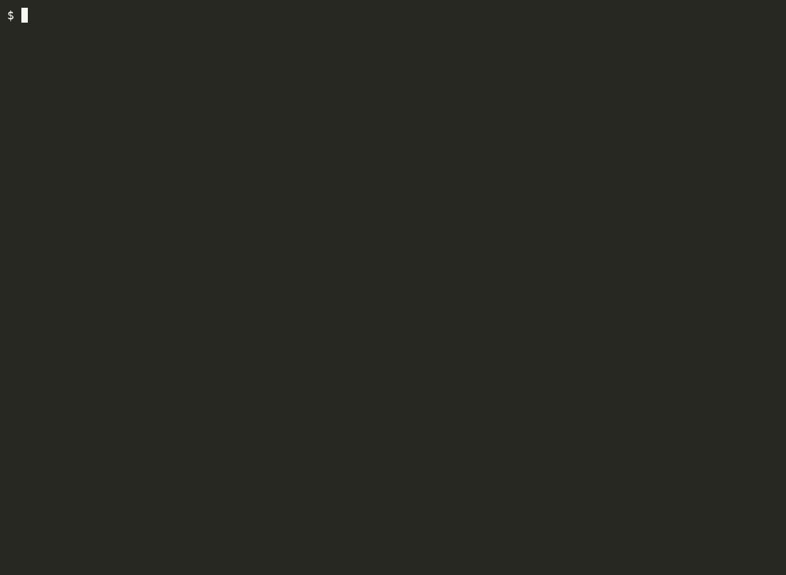

# lockrot

[](https://github.com/somework/lockrot/actions/workflows/ci.yml)
[](https://packagist.org/packages/somework/lockrot)
[](https://packagist.org/packages/somework/lockrot)
[](https://github.com/somework/lockrot/releases/latest)
[](LICENSE)

**lockrot finds the packages in `composer.lock` that nobody maintains any more, including the ones
`composer audit` passes because no maintainer marked them abandoned.**

Each finding carries its evidence and the dependency chain that pulled it in. lockrot reads
`composer.lock` and `composer.json` and writes neither.

```bash
composer require --dev somework/lockrot
composer config allow-plugins.somework/lockrot true
composer lockrot
```

Needs PHP 7.4+ and Composer 2.2+; the standalone PHAR needs only PHP 7.4+ ([Install](#install)).

[See a full recorded run on a real project's lock →](https://lockrot.dev/example-run/)

## Contents

[Install](#install) · [First run](#first-run) · [What it reports](#what-it-reports) ·
[In CI](#in-ci) · [Not every finding is a problem](#not-every-finding-is-a-problem) ·
[Configuration](#configuration) · [Documentation](#documentation) · [Limitations](#limitations) ·
[Roadmap](#roadmap) · [Contributing](#contributing) · [Security](#security) · [License](#license)

## Install

The Composer plugin needs PHP 7.4+ and Composer 2.2+ and adds `composer lockrot` (alias
`composer rot`):

```bash
composer require --dev somework/lockrot
composer config allow-plugins.somework/lockrot true
```

The `composer config` line grants the plugin permission Composer asks for.

The plugin also prints a short summary of flagged packages during `composer require`, `update` and
`install`; set `extra.lockrot.install-time` to `off` to silence it
([Install-time summary](https://lockrot.dev/install-time/)).

The standalone PHAR needs only PHP 7.4+ and adds nothing to your project:

```bash
curl -fsSL -o lockrot.phar https://lockrot.dev/lockrot.phar
php lockrot.phar -d /path/to/project
```

- **Verify the download:** `phive install somework/lockrot` downloads the PHAR and checks its GPG
  signature in one step. The sha256, GPG and build-attestation checks by hand are in
  [Verifying the download](https://lockrot.dev/phar/#verifying-the-download).
- **Update it:** `php lockrot.phar self-update` checks the new release's sha256 and signature
  before it replaces the archive; see [Keeping it updated](https://lockrot.dev/phar/#keeping-it-updated).

## First run

Goal: see what in your lock is unmaintained, why, and how to act on it. You need the plugin
installed and, for a complete run, a GitHub token in `GITHUB_TOKEN`
([Repository hosts and credentials](https://lockrot.dev/internals/#repository-hosts-and-credentials)).

1. Run it:

    ```bash
    composer lockrot
    ```

    lockrot checks against `config.platform.php`, else the PHP running Composer. Pass
    `--target-php=<version>` when that is not the PHP your project runs on in production.

    Findings are grouped by priority. Each row gives the verdict, the package, how it is reached
    (`direct` or `via …`) and the evidence. The summary block under the list counts every verdict,
    sums the [libyears](https://lockrot.dev/verdicts/#libyears), and names the direct requirements
    that pull in the most flagged packages.

    A real run, recorded as a terminal session. The [recorded run on wallabag's
    lock](https://lockrot.dev/example-run/) gives a larger one in full, as text.

    

2. Ask why one package is flagged, or why it is not:

    ```bash
    composer lockrot --explain=vendor/package
    ```

    Prints the package's verdict, priority and every signal with its dates
    ([Explaining one package](https://lockrot.dev/configuration/#explaining-one-package)).

3. Accept what you have decided to live with, so CI fails only on what is new or worse:

    ```bash
    composer lockrot --generate-baseline
    ```

    Writes `lockrot-baseline.json` next to `composer.json` (or at the `baseline` path) and exits
    `0` whatever `--fail-on` says; `--strict-network` still applies. Commit the file
    ([Baseline](https://lockrot.dev/baseline/)).

4. Fail the build on the findings that matter to you:

    ```bash
    composer lockrot --fail-on=silent
    ```

    Exits `1` when a finding that is new or worse than the baseline reaches `silent` or
    `abandoned` ([In CI](#in-ci)).

Next: [What it reports](https://lockrot.dev/verdicts/) for each verdict,
[every configuration key](https://lockrot.dev/configuration/), and [CI setup](https://lockrot.dev/ci/).

## What it reports

Each package gets one verdict:

| Verdict | Meaning |
|---|---|
| `abandoned` | Its Composer repository marks it abandoned, or its repository is archived on GitHub or GitLab |
| `silent` | No release and no push to its repository in years |
| `pinned` | Installed from a branch snapshot (`dev-main` or any other `dev-*` branch, `2.x-dev`), or the package has no tagged release |
| `left-behind` | The installed release branch stopped releasing while a newer branch still releases |
| `old-promise` | Released before the target PHP major existed, and admits it only because `require.php` has no upper bound |
| `stale` | An old release or an old push, short of `silent` |
| `unknown` | No data could be obtained |
| `finished` | On the built-in or project allowlist, or a metapackage: complete by design |
| `ok` | None of the above |

- **Priority** (`critical` to `low`) says how much a finding matters to this project: it starts
  from the verdict and drops for a transitive or development-only package
  ([Priority](https://lockrot.dev/verdicts/#priority)).
- **Security advisories:** on a flagged package, lockrot names the release that fixes each
  advisory `composer audit` reports, or says none is expected
  ([Security advisories](https://lockrot.dev/verdicts/#security-advisories)).
- **Transitive exposure:** a transitive finding names every direct requirement that reaches it, and
  each direct requirement's evidence lists the flagged packages it pulls in
  ([Transitive exposure](https://lockrot.dev/verdicts/#transitive-exposure)).
- **Libyears:** the summary's `libyears:` line sums, over the lock, the years between each
  installed release and the package's newest stable one ([Libyears](https://lockrot.dev/verdicts/#libyears)).

[What it reports: every verdict, signal and threshold →](https://lockrot.dev/verdicts/)

## In CI

Run the same command as a CI step, with `GITHUB_TOKEN` in the step's environment:

```yaml
- name: lockrot
  run: composer lockrot --fail-on=silent
  env:
    GITHUB_TOKEN: ${{ secrets.GITHUB_TOKEN }}
```

- **`--fail-on`** takes a verdict (fail on what was observed), a priority (fail on how much it
  matters here) or `unchecked` (fail when a check could not run).
- **Exit codes:** `0` passed, `1` a finding reached `--fail-on`, `2` lockrot could not run
  ([Exit codes](https://lockrot.dev/ci/#exit-codes)).
- **Lookup failures** are reported as run notes and do not fail the run; `--strict-network` makes
  them exit `1`.
- **Formats:** `--format` takes `table` (default), `json`, `github` (annotations), `sarif` (code
  scanning), `gitlab` (Code Quality), `markdown` (PR comment) or `html` (one self-contained page).
  Each `--output=<format>:<path>` writes one more from the same run
  ([Writing reports to files](https://lockrot.dev/configuration/#writing-reports-to-files)).

Choosing a threshold and what each format gives: [In CI](https://lockrot.dev/ci/).

On GitHub Actions, [somework/lockrot-action](https://github.com/somework/lockrot-action) v1 runs
lockrot in one step:

```yaml
- uses: somework/lockrot-action@v1
  with:
    fail-on: silent
```

On other CI systems, use the PHAR or the Docker image `ghcr.io/somework/lockrot`
([The Docker image](https://lockrot.dev/phar/#the-docker-image)).

## Not every finding is a problem

- **Baseline:** `--generate-baseline` records the findings you accept; later runs fail only on new
  or worsened ones. Matching is by package name, so a version bump stays accepted and a worse
  verdict fails again ([Baseline](https://lockrot.dev/baseline/)).
- **Allowlist:** packages finished by design report as `finished`. lockrot ships a built-in list
  (`psr/*`, `fig/*`, `symfony/polyfill-*` and others). Add your own under `extra.lockrot.ignore`;
  `package` and `reason` are required, `version` and `expires` optional:

    ```json
    { "extra": { "lockrot": { "ignore": [
        { "package": "acme/legacy-bridge", "reason": "internal fork, tracked in ACME-123", "expires": "2027-01-01" }
    ] } } }
    ```

    See [The allowlist](https://lockrot.dev/configuration/#the-allowlist).

## Configuration

Settings live under `extra.lockrot` in `composer.json`. A CLI option wins over an environment
variable, which wins over `composer.json`. The keys most projects set:

| `extra.lockrot` key | CLI option | Default | Effect |
|---|---|---|---|
| `fail-on` | `--fail-on` | `none` | Exit `1` threshold: a verdict, a priority or `unchecked` |
| `target-php` | `--target-php` | `config.platform.php`, else the running PHP | The PHP version the project runs on: decides `old-promise`, and which newer branch a `left-behind` finding tells you to move to |
| `include-dev` | `--dev` | `false` | Also check `packages-dev` |
| `format` | `--format` | `table` | Output format |
| `ignore` | — | `[]` | Project allowlist |

A key lockrot does not know gets one warning line on stderr and changes nothing
([Unknown keys](https://lockrot.dev/configuration/#unknown-keys)).

[Every key, environment variable and option →](https://lockrot.dev/configuration/)

## Documentation

The full documentation is at [lockrot.dev](https://lockrot.dev); its home page routes you by task.
What changed in each release is in the [changelog](https://lockrot.dev/changelog/).

## Limitations

- **Hosts:** repository activity comes from GitHub, GitLab (gitlab.com and every host in
  Composer's `gitlab-domains`) and Bitbucket Cloud, not GitHub Enterprise or Bitbucket Server. The
  archived flag needs a token on GitLab and does not exist on Bitbucket
  ([Repository hosts and credentials](https://lockrot.dev/internals/#repository-hosts-and-credentials)).
- **Anonymous caps:** without a GitHub token, GitHub is asked only about packages already stale on
  release age, up to a per-run cap. Bitbucket Cloud has the same cap until Composer has credentials
  for bitbucket.org. The report counts what the cap skipped
  ([Repository hosts and credentials](https://lockrot.dev/internals/#repository-hosts-and-credentials)).
- **Package metadata** comes from the Composer repositories your project configures; a Satis build
  needs `notify-batch` set ([Which repository answers](https://lockrot.dev/internals/#two-passes)).
- **No inherited verdicts:** a package is never flagged for what it depends on. Its evidence and the
  `pulled in by:` line say what it pulls in
  ([Transitive exposure](https://lockrot.dev/verdicts/#transitive-exposure)).
- **`composer require --dev … --dry-run`:** the install-time summary can read a new package's priority
  one step high ([Under `--dry-run`](https://lockrot.dev/install-time/#a-note-on-the-dry-run-development-flag)).

## Roadmap

Planned and proposed work is tracked as
[enhancement issues](https://github.com/somework/lockrot/issues?q=is%3Aissue+label%3Aenhancement).

## Contributing

Bug reports, fixes and additions to the built-in allowlist are welcome; see
[`CONTRIBUTING.md`](CONTRIBUTING.md). What counts as public interface is in
[Backward compatibility](CONTRIBUTING.md#backward-compatibility). The stability promise for reports
and options: [Compatibility](https://lockrot.dev/compatibility/).

## Security

To report a security issue, follow [`SECURITY.md`](SECURITY.md) rather than opening a public issue.
What lockrot reads, writes and contacts is in
[What lockrot does and does not do](SECURITY.md#what-lockrot-does-and-does-not-do).

## License

MIT; see [`LICENSE`](LICENSE). Written by Igor Pinchuk.
